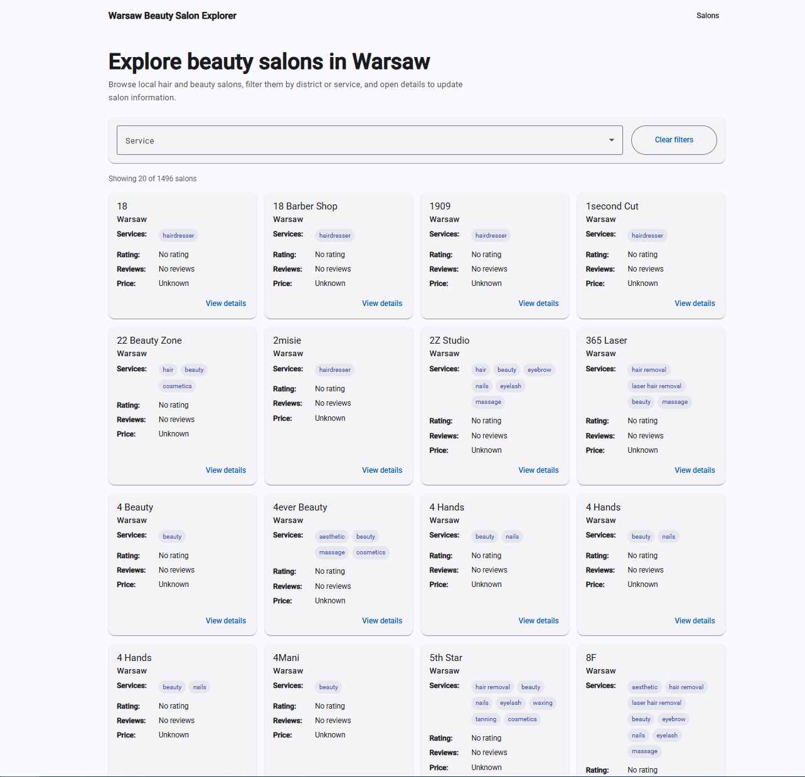
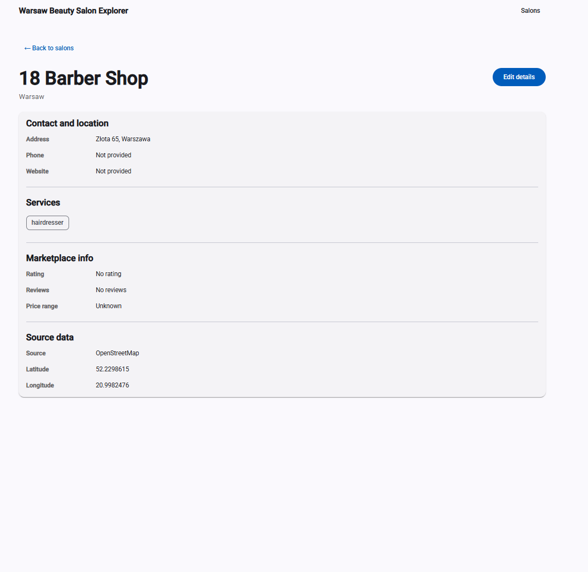
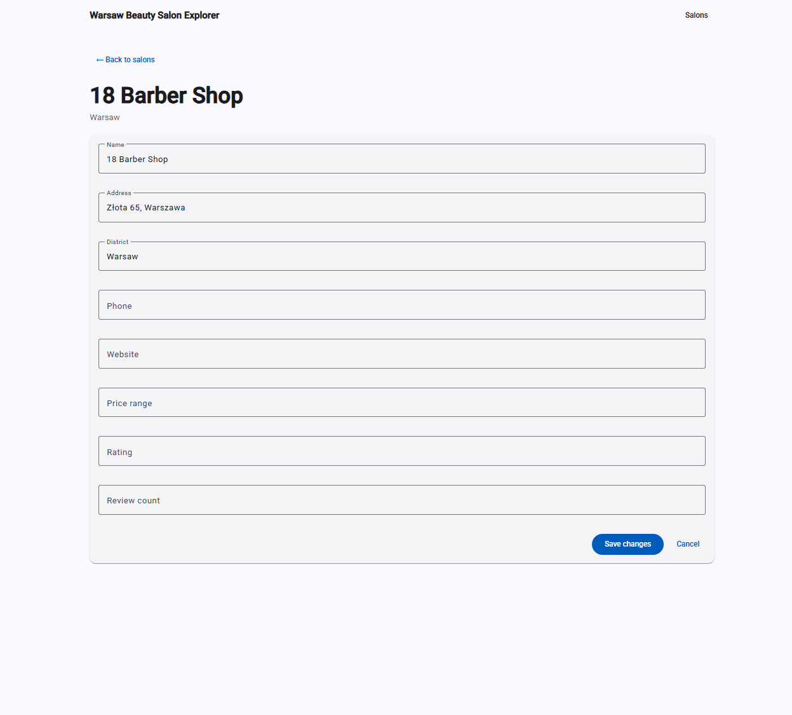

# Warsaw Beauty Salon Explorer

A full-stack application for discovering and managing beauty salons in Warsaw.

Built as part of the SumUp Accelerator recruitment task.

---

## Features

### Salon listing

- Browse beauty salons in Warsaw
- Pagination
- Service-based filtering
- Responsive card layout

### Salon details

- View full salon information
- Address
- Phone number
- Website
- Services
- Ratings and reviews
- Geographic coordinates

### Salon management

- Edit salon details
- Persist changes through REST API
- Store updates in PostgreSQL

### Data collection

- Imported from OpenStreetMap Overpass API
- Deduplicated before persistence
- Exported to a local JSON seed for stable application startup

---

## Screenshots

### Salon Listing



### Salon Details



### Salon Editing



---

## Tech Stack

### Backend

- Java 25
- Spring Boot
- Spring Data JPA
- Hibernate
- PostgreSQL
- Maven
- Swagger OpenAPI

### Frontend

- Angular 20
- TypeScript
- Angular Material
- SCSS

### Infrastructure

- Docker
- Docker Compose

---

## Architecture

### Backend

```txt
Controller
    ↓
Service
    ↓
Repository
    ↓
PostgreSQL
```

### Frontend

```txt
Pages
    ↓
API Service
    ↓
REST API
```

---

## Project Structure

```txt
salonExplorer/
├── frontend/
├── src/
├── docs/
├── compose.yaml
├── pom.xml
└── README.md
```

---

## Running the application

### 1. Start PostgreSQL

```bash
docker compose up -d
```

### 2. Start backend

```bash
./mvnw spring-boot:run
```

Backend:

```txt
http://localhost:8080
```

Swagger:

```txt
http://localhost:8080/swagger-ui.html
```

### 3. Start frontend

```bash
cd frontend

npm install

npm start
```

Frontend:

```txt
http://localhost:4200
```

---

## API Examples

### Get salons

```http
GET /api/salons?page=0&size=20
```

### Filter by service

```http
GET /api/salons?service=hairdresser
```

### Get salon details

```http
GET /api/salons/{id}
```

### Update salon

```http
PATCH /api/salons/{id}
```

Request body:

```json
{
  "phoneNumber": "+48 123 456 789",
  "websiteUrl": "https://example.com"
}
```

---

## Data Quality

The application imports beauty salons from OpenStreetMap.

During import:

- duplicate salons are removed
- service tags are normalized
- service groups are split into individual values

Example:

```txt
aesthetic;cosmetics;hair_removal
```

becomes:

```txt
aesthetic
cosmetics
hair_removal
```

---

## Challenges

### District information

OpenStreetMap provides district information inconsistently.

For the MVP version, district data is preserved when available, but the primary filtering mechanism is service type.

### Overpass API rate limiting

Overpass API can return HTTP 429 responses.

To make the application stable and reproducible, imported data is exported to a local JSON seed and loaded from persistent storage.

---

## Future Improvements

- Authentication and authorization
- Map integration (Leaflet/OpenStreetMap)
- Image galleries
- Advanced search
- Sorting UI
- Full test coverage
- Import scheduling
- Poland-wide salon coverage

---

## Author

Kacper Cep